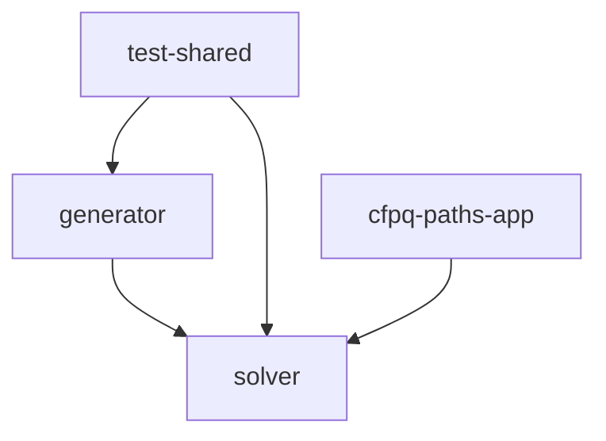
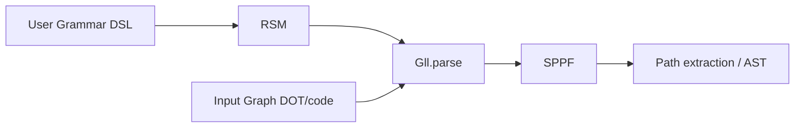

# AGENTS.md

This file helps AI agents understand and work with the UCFS codebase.

## Project Overview

**UCFS** (Universal Context-Free Solver) is a Kotlin library that performs context-free path querying on edge-labeled directed graphs using a modified GLL (Generalized LL) parsing algorithm with Recursive State Machines (RSM).

**Key capabilities:**
- Parse arbitrary directed graphs against context-free grammars
- Produce SPPF (Shared Packed Parse Forest) — compact representation of all matching paths
- Support for grammar definition via Kotlin DSL
- DOT graph format support

## Module Structure

| Module | Description |
|--------|-------------|
| `solver/` | Core library — GLL parser, RSM, grammar DSL, SPPF, input graph |
| `generator/` | Code generator built on solver — AST extraction, parser generation |
| `test-shared/` | Shared test infrastructure, dynamic tests, ANTLR4 comparison |
| `cfpq-paths-app/` | Runnable demo application with examples |

### Module Dependencies



## Build System

- **Tool:** Gradle with Kotlin DSL (`build.gradle.kts`)
- **Wrapper:** `./gradlew` included, no local Gradle install needed
- **JDK:** 11+ (toolchain configured in each module)
- **Kotlin:** 2.4.0

### Essential Commands

```bash
./gradlew build                        # Build all modules
./gradlew test                         # Run all tests
./gradlew testCodeCoverageReport       # Generate coverage report (HTML + XML)
./gradlew jacocoTestCoverageVerification  # Verify coverage thresholds
./gradlew :cfpq-paths-app:runSimpleExamples  # Run demo examples
```

### Coverage Thresholds

| Counter | Minimum |
|---------|---------|
| Instruction | 95% |
| Branch | 80% |
| Line | 80% |
| Method | 85% |
| Class | 90% |

## Code Conventions

- **Style:** `kotlin.code.style=official` (set in `gradle.properties`)
- **Package root:** `org.ucfs` for all modules
- **Naming:** PascalCase for classes, camelCase for functions/properties
- **Testing:** JUnit 5 with `useJUnitPlatform()`

## Documentation Conventions

- **Structured over ASCII:** Use Mermaid diagrams (`graph TD`, `flowchart LR`) and tables instead of ASCII art or text-based schemas — they render natively on GitHub
- **Unified style:** All documentation follows a consistent structure: purpose → prerequisites → content → cross-references
- **Developer docs:** Place in `dev/` directory; user-facing docs go to `docs/docs/`

## Key Source Files

| File | Purpose |
|------|---------|
| `solver/.../parser/Gll.kt` | Main GLL parser implementation |
| `solver/.../grammar/combinator/Grammar.kt` | Grammar DSL base class |
| `solver/.../rsm/RsmState.kt` | RSM state representation |
| `solver/.../gss/GraphStructuredStack.kt` | GSS data structure for GLL |
| `solver/.../sppf/SppfStorage.kt` | SPPF node management |
| `solver/.../input/InputGraph.kt` | Input graph representation |
| `generator/.../ast/AstExtractor.kt` | AST extraction from SPPF |

## Key Abstractions

- **`Grammar`** — DSL base class; users extend it to define CFGs
- **`RsmState`** — Recursive State Machine state; grammar compiles to RSM
- **`Gll`** — Parser that runs RSM against input graph
- **`IInputGraph<V, L>`** — Generic graph interface with vertices and labeled edges
- **`RangeSppfNode`** — SPPF node representing a range of matched input
- **`Descriptor<V>`** — Processing unit in GLL: (position, GSS node, RSM state, SPPF node)

## Data Flow



## CI/CD

Three GitHub Actions workflows:
- `ci-test-infrastructure.yaml` — Tests + JaCoCo coverage on push/PR
- `ci-docs.yaml` — MkDocs site deployment
- `ci-publishing-jar-files.yaml` — Maven package publishing to GitHub Packages

## Documentation

- **User docs:** `docs/docs/` (MkDocs, deployed to GitHub Pages)
- **Developer docs:** `dev/` directory
  - `dev/ARCHITECTURE.md` — Detailed architecture overview
  - `dev/DEVELOPMENT.md` — Local development setup guide
