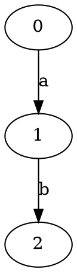
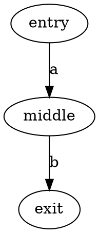
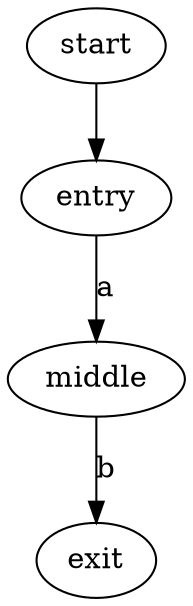
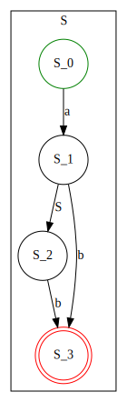

## Tutorial

This guide will help you understand how to use UCFS.

## Basic concepts and terms

**UCFS** is a universal tool designed to solve problems that lie at the intersection of context-free languages and
labeled directed graphs. It is based on the **GLL** algorithm.

**Generalized LL parsing ([GLL](https://link.springer.com/chapter/10.1007/978-3-662-46663-6_5))** is a parsing technique
that extends traditional LL parsing to handle any context-free
grammar.

* Generalized means the parser can handle any context-free grammar, including left-recursive and ambiguous ones

The name *LL* itself stands for

* Left-to-right scanning of the input
* Leftmost derivation (the parse tree is constructed by expanding the leftmost nonterminal first)

**RSM** (Recursive State Machine) is an automaton-like representation of context-free languages.

**SPPF** (Shared Packed Parse Forest) is a derivation-tree-like structure that represents **all** possible paths
satisfying the specified grammar. If the number of such paths is infinite, the SPPF contains cycles.
SPPF consists of nodes. Each node has a unique Id and detailed information specific to its
type.

## Introduction to context-free languages

A context-free language is a set of strings that can be generated by a set of replacement **rules**.

Each rule looks like this:

```
A -> something
```

* Left side: one symbol (called a non-terminal)
* Right side: a sequence of terminals and non-terminals

Terminal — a concrete symbol. Cannot be replaced further

Non-terminal — a placeholder that must be replaced using rules

**Example:**

Grammar for $a^nb^n$ (n $a$ followed by n $b$):

```
S -> a S b
S -> ε
```

Here $S$ is a non-terminal, $a$ and $b$ are terminals, $ε$ means empty.

**Context-free** means, that you can replace a non-terminal anywhere, anytime, regardless of what surrounds it. The rule
does not look at neighbors.

## Defining graphs

UCFS accepts graphs in DOT format.

**DOT** is a plain-text format for describing graphs. It uses a simple structure:

* Vertices (nodes)
* Edges between vertices
* Optional labels on edges



This describes:

* Vertices: $0, 1, 2$
* Edge from $0$ to $1$ labeled $a$
* Edge from $1$ to $2$ labeled $b$

Vertices can be defined explicitly:



UCFS needs to know where to start:



## Defining the grammar

UCFS uses a DSL (Domain Specific Language) to
define context-free grammars.

Basic structure:

```kotlin
class MyGrammar : Grammar() {
    val S by Nt().asStart()

    init {
        S /= "a" * "b"
    }
}
```

This defines the language $ab$ (single $a$ followed by single $b$)

You can read more about DSL and find other operations for defining grammars by following
the [link](https://formallanguageconstrainedpathquerying.github.io/UCFS/dsl/)

## Getting started with UCFS

> [!CAUTION]
> For demo purposes only!
> Do not expect big graphs to be processed successfully (in reasonable time or without out-of-memory errors).

**Requirements**: 11 java

Before running, understand the pipeline:

```
INPUT 1: Grammar (CFG) ─────┐
                            ├─> UCFS ──► OUTPUT: SPPF
INPUT 2: Graph (DOT) ───────┘
```

* Grammar describes a language (set of strings)
* Graph contains many paths (each path produces a string of edge labels)
* UCFS finds every path whose string belongs to the grammar's language

Example:

```
Grammar: S -> a b          (language: just "ab")
Graph:   0 -a-> 1 -b-> 2    (one path: "ab")
         0 -a-> 3 -b-> 2    (another path: "ab")

UCFS finds: BOTH paths (both produce "ab")
Result: SPPF with two packed alternatives
```

Default locations:

* Input graphs ```cfpq-paths-app/src/main/resources```
* Generated SPPF ```cfpq-paths-app/gen/sppf```

## Types of nodes in SPPF

The resulting SPPF consists of several types of nodes. Each node has a unique ID and stores specific information.

* **Nonterminal** node contains the name of the non-terminal and pairs of vertices from the input graph that are the
  start and end of paths derived from that non-terminal.

  

  This node has number ```0``` and is the root of all derivations for all paths from 1 to 4 derivable from non-terminal
  ```S```

* **Terminal** node is a leaf and corresponds to an edge.

  

  This node depicts edge ```3 -alloc-> 4```.

* **Epsilon** node is a simplified way to represent that $\varepsilon$ is derived at a specific position.

  

* **Range** node is a supplementary node that helps reuse subtrees.

  

  This node represents all subpaths from 0 to 4 that are accepted while the RSM transitions from ```S_0``` to ```S_2```.

* **Intermediate** node is a supplementary node used to connect subpaths.

  

  This node depicts that the path from 0 to 2 is composed of two parts: from 0 to 1 and from 1 to 2.

## Using UCFS with simple examples

It is necessary to set the grammar in the code located
```cfpq-paths-app/src/main/kotlin/org.ucfs.paths/examples/example_1.kt```

**Grammar assignment**

Let's define the grammar of the language $a^n b^n$, which defines a set of words that start with $n$ letters $a$ and end
with $n$ letters $b$ (Examples: $ab$, $aabb$, $aaabbb$)
> [!NOTE]
> Please note that we can do this in several ways.
>```kotlin
>class PointsToAnBnGrammar : Grammar() {
>    val S by Nt().asStart()
>
>    init {
>        S /= "a" * Option(S) * "b"
>    }
>}
>```
>or
>```kotlin
>class PointsToAnBnGrammar : Grammar() {
>    val S by Nt().asStart()
>
>    init {
>        S /= "a" * (Epsilon or S) * "b"
>    }
>}
>```

Let's construct an RSM for the $a^n b^n$ grammar:



We can see how the starting non-terminal $S$ turns into either a concatenation of terminals $ab$ or a concatenation of a
non-terminal and terminals $aSb$

> [!NOTE]
> To confirm this, look at the labels along the edges of the path from the source node (green circle) to the sink node
> (red circle).

**To run (from project root):**

```bash
./gradlew :cfpq-paths-app:runSimpleExamples 
```

**Example 1: Simple graph with a <ins>finite</ins> set of paths**

**Input graph:**


Let's find *all* words that satisfy the language's grammar:

* $ab$ (0 -a-> 1 -b-> 2)
* $aabb$ (0 -a-> 1 -a-> 2 -b-> 1 -b-> 2)

**Resulting SPPF graph:**


**Let's see what the use of the algorithm gives us:**

Let's divide SPPF into two trees:

**The *first* tree:**


We can actually see that this tree gives us the word $ab$

**The *second* tree:**


When we parse this tree, we can see that this tree gives us the word $aabb$

Thus, the algorithm produced exactly what was expected.

**Example 2: Simple graph with an <ins>infinite</ins> number of paths #1**

**Input graph:**


Let's find *some* words that satisfy the language's grammar:

* $ab$ (0 -a-> 1 -b-> 1)
* $aaabbb$ (0 -a-> 1 -a-> 0 -a-> 1 -b-> 1 -b-> 1 -b-> 1)
* ...

> [!NOTE]
> We get an infinite number of words that obey the rule: $a^nb^n$ & $n$ is odd

**Resulting SPPF graph:**


> [!NOTE]
> This example demonstrates that despite the infinite number of paths, the graph will be finite, as a limit is provided.

**Let's see what the use of the algorithm gives us:**

Let's divide SPPF into two trees:

**The *first* tree:**


We can actually see that this tree gives us the word $ab$

**The *second* tree:**


When we analyze this tree, we see that this tree gives us the word $aaSbb$

> [!NOTE]
> We can see that there is a cycle in the graph. We can also see that the second word contains a non-terminal, which we
> can also replace with $ab$ or $aaSbb$, so we can get the words $aaabbb$, $aaaaSbbbb$ -> $aaaaabbbbb$ etc.

Thus, the algorithm produced exactly what was expected.

**Example 3: Simple graph with an <ins>infinite</ins> set of paths #2**

**Input graph:**


Let's find *some* words that satisfy the language's grammar:

* $ab$ (1 -a-> 2 -b-> 3)
* $aabb$ (0 -a-> 1 -a-> 2 -b-> 3 -b-> 2)
* $aaabbb$ (2 -a-> 0 -a-> 1 -a-> 2 -b-> 3 -b-> 2 -b-> 3)
* ...

> [!NOTE]
> We get an infinite number of words. Words cover the entire language thanks to several starting points.

**Resulting SPPF graph** is too big, you can find it in
```src/main/resources/figures/example_3_graph_sppf.dot.svg```

## Using UCFS to complex examples

Let's move on to examples that demonstrate the tool's performance in real-life scenarios.

**Grammar and code for paths extraction:** ```cfpq-paths-app/src/main/kotlin/org.ucfs.paths/Main.kt```

**To run (from project root)**:

```bash
./gradlew :cfpq-paths-app:run
```

> [!NOTE]
> We implemented a very naive path extraction algorithm solely to demonstrate SPPF traversal.

We provide a few code snippets, the corresponding graphs to be analyzed, parts of the resulting SPPFs, and extracted
paths.

For analysis, we use the following extended points-to grammar (start non-terminal is ```S```), which allows us to
analyze chains of fields.

```
PointsTo -> ("assign" | ("load_i" Alias "store_i"))* "alloc"
FlowsTo -> "alloc_r" ("assign_r" | ("store_i_r" Alias "load_o_r"))*
Alias -> PointsTo FlowsTo
S -> (Alias? "store_i")* PointsTo
```

For all our examples, we use a common grammar with $i \in [0..3]$.
The corresponding RSM is presented below:


### Example 1

Code snippet:

```java
val n = new X()
val y = new Y()
val z = new Z()
val l = n
val t = y
l.u = y
t.v = z
```

Respective graph:


Resulting SPPF:


Three trees are extracted because there are three paths of interest from node 1.
We do not extract subpaths derivable from non-terminals ```Alias``` and ```PointsTo```, as they contain no useful
information for restoring fields.

Respective paths:

* [(1-PointsTo->0)]

  This path is trivial. Such paths will be omitted in further examples.

* [(1-Alias->2), (2-store_0->3), (3-PointsTo->4)]

  This path means that ```n.u = new Y()```. Vertex 2 is an alias for 1 (corresponding to ```n```), and 2 has a field ```u``` that points to ```new Y()``` (```store_0``` corresponds to ```l.u = y```).

* [(1-Alias->2), (2-store_0->3), (3-Alias->5), (5-store_1->6), (6-PointsTo->7)]

  This path means that ```n.u.v = new Z()```.

### Example 2

Code snippet:

```java
val n = new X()
val l = n
while (...){    
    l.next = new X()
    l = l.next
}
```

Respective graph:


Part of resulting SPPF:


This part contains a cycle formed by vertices 27–31–34–37–38–40–42–44–47–49–52–56 (colored in red). This is because
there are infinitely many paths of interest. We extract some of them:

* [(0-Alias->2), (2-store_0->3), (3-PointsTo->4)]

  ```n.next = new X () // line 4```

* [(0-Alias->2), (2-store_0->3), (3-Alias->2), (2-store_0->3), (3-PointsTo->4)]

  ```n.next.next = new X () // line 4```

* [(0-Alias->2), (2-store_0->3), (3-Alias->2), (2-store_0->3), (3-Alias->2), (2-store_0->3), (3-PointsTo->4)]

  ```n.next.next.next = new X () // line 4```

* [(0-Alias->2), (2-store_0->3), (3-Alias->2), (2-store_0->3), (3-Alias->2), (2-store_0->3), (3-Alias->2), (2-store_0->3), (3-PointsTo->4)]

  ```n.next.next.next.next = new X () // line 4```

* [(0-Alias->2), (2-store_0->3), (3-Alias->2), (2-store_0->3), (3-Alias->2), (2-store_0->3), (3-Alias->2), (2-store_0->3), (3-Alias->2), (2-store_0->3), (3-PointsTo->4)]

  ```n.next.next.next.next.next = new X () // line 4```

* [(0-Alias->2), (2-store_0->3), (3-Alias->2), (2-store_0->3), (3-Alias->2), (2-store_0->3), (3-Alias->2), (2-store_0->3), (3-Alias->2), (2-store_0->3), (3-Alias->2), (2-store_0->3), (3-PointsTo->4)]

  ```n.next.next.next.next.next.next = new X () // line 4```

More paths can be extracted if needed. Traversal should be tuned accordingly.

### Example 3

Code snippet:

```java
val n = new X()
val l = n
while (...){
    val t = new X()
    l.next = t
    l = t
}
```

Respective graph:


Part of resulting SPPF:


This SPPF also contains a cycle (3–5–7–11), so there are infinitely many paths of interest, and we extract only a few of
them.

* [(0-Alias->1), (1-store_0->2), (2-PointsTo->3)]

  ```n.next = new X() // line 4```

* [(0-Alias->1), (1-store_0->2), (2-Alias->1), (1-store_0->2), (2-PointsTo->3)]

  ```n.next.next = new X() // line 4```

* [(0-Alias->1), (1-store_0->2), (2-Alias->1), (1-store_0->2), (2-Alias->1), (1-store_0->2), (2-PointsTo->3)]

  ```n.next.next.next = new X() // line 4```

* [(0-Alias->1), (1-store_0->2), (2-Alias->1), (1-store_0->2), (2-Alias->1), (1-store_0->2), (2-Alias->1), (1-store_0->2), (2-PointsTo->3)]

  ```n.next.next.next.next = new X() // line 4```

* [(0-Alias->1), (1-store_0->2), (2-Alias->1), (1-store_0->2), (2-Alias->1), (1-store_0->2), (2-Alias->1), (1-store_0->2), (2-Alias->1), (1-store_0->2), (2-PointsTo->3)]

  ```n.next.next.next.next.next = new X() // line 4```

* [(0-Alias->1), (1-store_0->2), (2-Alias->1), (1-store_0->2), (2-Alias->1), (1-store_0->2), (2-Alias->1), (1-store_0->2), (2-Alias->1), (1-store_0->2), (2-Alias->1), (1-store_0->2), (2-PointsTo->3)]

  ```n.next.next.next.next.next.next = new X() // line 4```

### Example 4

Code snippet:

```java
val n = new X()
val z = new Z()
val u = new U()
z.x = n
u.y = n
val v = z.x
v.p = new Y()
val r = u.y
r.q = new P()
```

Respective graph:


For this example, we omit the figure of the SPPF due to its size. However, we present the respective paths. Note that in
this example, we specify two vertices as start: 1 and 8.

* [(1-Alias->9), (9-store_3->11), (11-PointsTo->13)]

  ```n.q = new P()```

* [(1-Alias->8), (8-store_2->10), (10-PointsTo->12)]

  ```n.p = new Y() ```

* [(8-Alias->9), (9-store_3->11), (11-PointsTo->13)]

  ```v.q = new P() ```

* [(8-store_2->10), (10-PointsTo->12)]

  ```v.p = new Y() ```

* [(8-Alias->8), (8-store_2->10), (10-PointsTo->12)]

  ```v.p = new Y() ```


