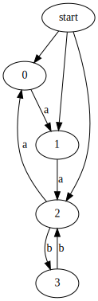
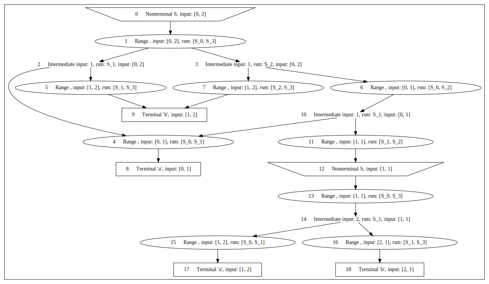
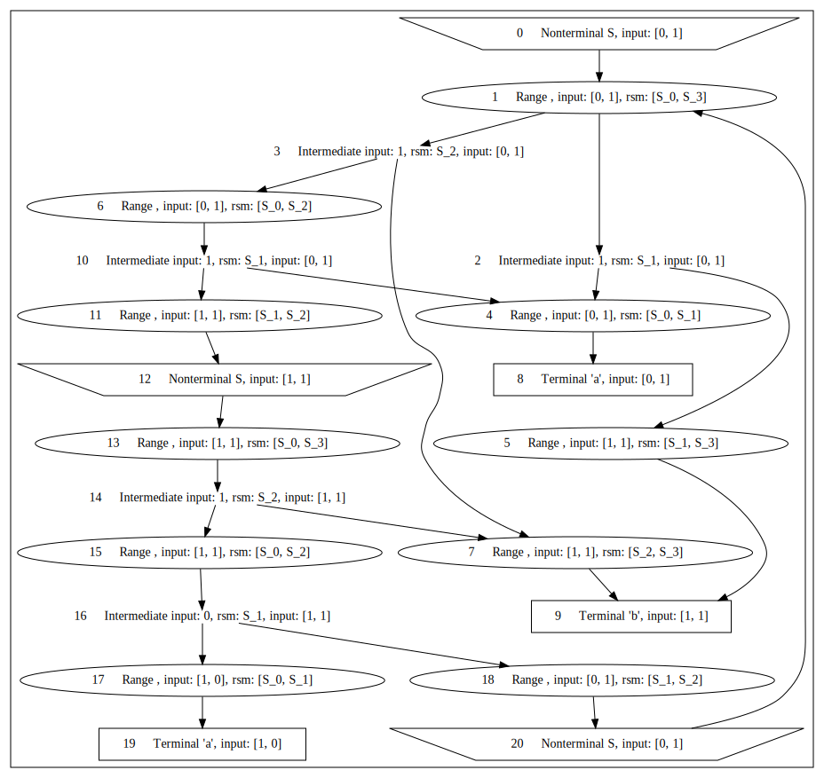

> [!IMPORTANT]
> This file is a tutorial and demonstration of how to use the UCFS tool.

**UCFS** is a universal tool designed to solve problems that lie at the intersection of context-free languages and
labeled directed graphs. It is based on the **GLL** algorithm.

**Generalized LL parsing (GLL)** is a parsing technique that extends traditional LL parsing to handle any context-free
grammar.  
The name *LL* itself stands for

* Left-to-right scanning of the input
* Leftmost derivation (the parse tree is constructed by expanding the leftmost nonterminal first)

**Requirements for use UCFS:** 11+ java version

**To run (from project root):**

```bash
./gradlew :cfpq-paths-app:runSimpleExamples 
```

**Code for path extraction:** ```src/main/kotlin/simple_examples/example_1.kt```


> [!TIP]
> You can read about how to define a context-free grammar using DSL, including what a terminal and a non-terminal are,
> as well as about operations, by following
> the [link](https://formallanguageconstrainedpathquerying.github.io/UCFS/dsl/).

## $a^nb^n$ Language

**Grammar assignment**

Let's define the grammar of the language $a^n b^n$, which defines a set of words that start with $n$ letters $a$ and end
with $n$ letters $b$ (Examples: $ab$, $aabb$, $aaabbb$)
> [!NOTE]
> Please note that we can do this in several ways.
>```kotlin
>class PointsToAnBnGrammar : Grammar() {
>    val S by Nt().asStart()
>
>    init {
>        S /= "a" * Option(S) * "b"
>    }
>}
>```
>or
>```kotlin
>class PointsToAnBnGrammar : Grammar() {
>    val S by Nt().asStart()
>
>    init {
>        S /= "a" * (Epsilon or S) * "b"
>    }
>}
>```

Let's construct an RSM for the $a^n b^n$ grammar:


We can see how the starting non-terminal $S$ turns into either a concatenation of terminals $ab$ or a concatenation of a
non-terminal and terminals $aSb$

> [!NOTE]
> To confirm this, look at the labels along the edges of the path from the tree root (green circle) to the final leaf
> (red circle).

**Example 1: Simple graph with a <ins>finite</ins> set of paths**

**Input graph:**



Let's find *all* words that satisfy the language's grammar:

* $ab$ (0 -a-> 1 -b-> 2)
* $aabb$ (0 -a-> 1 -a-> 2 -b-> 1 -b-> 2)

**Resulting SPPF graph:**



**Example 2: Simple graph with an <ins>infinite</ins> number of paths #1**

**Input graph:**


Let's find *some* words that satisfy the language's grammar:

* $ab$ (0 -a-> 1 -b-> 1)
* $aaabbb$ (0 -a-> 1 -a-> 0 -a-> 1 -b-> 1 -b-> 1 -b-> 1)
* ...

> [!NOTE]
> We get an infinite number of words that obey the rule: $a^nb^n$ & $n$ is odd

**Resulting SPPF graph:**



> [!NOTE]
> This example demonstrates that despite the infinite number of paths, the graph will be finite, as a limit is provided.

**Example 3: Simple graph with an <ins>infinite</ins> set of paths #2**

**Input graph:**


Let's find *some* words that satisfy the language's grammar:

* $ab$ (1 -a-> 2 -b-> 3)
* $aabb$ (0 -a-> 1 -a-> 2 -b-> 3 -b-> 2)
* $aaabbb$ (2 -a-> 0 -a-> 1 -a-> 2 -b-> 3 -b-> 2 -b-> 3)
* ...

> [!NOTE]
> We get an infinite number of words. Words cover the entire language thanks to several starting points.

**Resulting SPPF graph** is too big, you can find it in
```src/main/kotlin/simple_examples/figures/example_3_graph_sppf.dot.svg```

*Default location of all generated SPPFs:* ```src/main/kotlin/simple_examples/gen```
