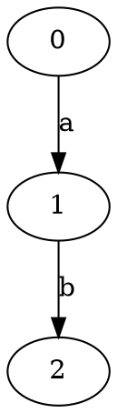
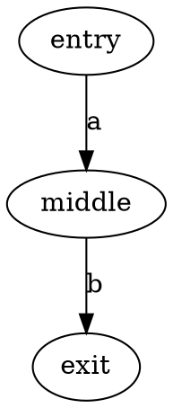
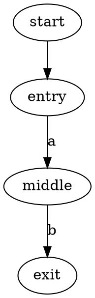

# Defining graphs

UCFS operates on edge-labeled directed graphs. Internally, a graph is represented as `InputGraph` (see `IInputGraph`):
vertices, labeled edges between them, and one or more start vertices where path exploration begins.

You can provide a graph in several ways:

* **Programmatically in Kotlin** — create an `InputGraph`, mark start vertices with `addStartVertex`, and add labeled
* edges with `addEdge`.
* **From a DOT file or string** — parse with `DotParser`: `parseDotFile(path)` or `parseDot(text)`.
* **From resources** — load a `.dot` file from the classpath (as in the tutorial examples below).

For example, the same graph as in the DOT examples below can be built in code:

```kotlin
val graph = InputGraph<Int, TerminalInputLabel>()
graph.addStartVertex(0)
graph.addEdge(0, TerminalInputLabel(Term("a")), 1)
graph.addEdge(1, TerminalInputLabel(Term("b")), 2)
```

The examples in this guide use DOT, so the following section walks through that format in detail.

## Example: DOT format

[DOT](https://graphviz.org/doc/info/lang.html) is a plain-text format for describing graphs. It uses a simple structure:

* Vertices (nodes)
* Edges between vertices
* Optional labels on edges



This describes:

* Vertices: $0, 1, 2$
* Edge from $0$ to $1$ labeled $a$
* Edge from $1$ to $2$ labeled $b$

Vertices can be defined explicitly:



UCFS needs to know where to start. In DOT, mark start vertices with edges from a dedicated `start` node:



To load such a graph in code:

```kotlin
val graph = DotParser().parseDotFile("<path to DOT file>")
// or
val graph = DotParser().parseDot(dotString)
```
