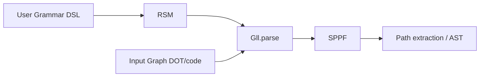

# Architecture

## Overview

UCFS implements a modified GLL (Generalized LL) parsing algorithm that operates on arbitrary edge-labeled directed graphs instead of linear text input. The grammar is specified as a context-free grammar and compiled into a Recursive State Machine (RSM), which drives the parser.

## Module Architecture

### solver/

The core library containing all parsing infrastructure.

**Packages:**

| Package | Responsibility |
|---------|---------------|
| `grammar.combinator` | Grammar DSL — `Grammar`, `Nt`, `Term`, operators (`*`, `or`, `many`, `opt`) |
| `rsm` | Recursive State Machine — `RsmState`, `Symbol`, `Nonterminal`, `Term` |
| `parser` | GLL engine — `Gll`, `IGll`, `Context`, `ParsingException` |
| `gss` | Graph Structured Stack — `GraphStructuredStack`, `GssNode`, `GssEdge` |
| `sppf` | Shared Packed Parse Forest — `SppfStorage`, `RangeSppfNode`, serialization |
| `input` | Input graph model — `InputGraph`, `Edge`, `ILabel`, DOT parsing |
| `descriptors` | Processing descriptors — `Descriptor`, `DescriptorsStorage` |
| `intersection` | RSM-graph intersection engine — `IntersectionEngine`, `IIntersectionEngine` |

### generator/

Code generation layer built on top of solver. Generates Kotlin AST node classes and parser code from grammar definitions.

**Packages:**

| Package | Responsibility |
|---------|---------------|
| `ast` | AST extraction, node class generation, DOT writing for AST |
| `parser` | Parser generators — `ParserGenerator`, `ScanerlessParserGenerator`, `RecoveryParserGenerator` |
| `examples` | Grammar examples (Dyck language, simple Go) |

### test-shared/

Shared test infrastructure with dynamic test generation and ANTLR4 comparison tests.

### cfpq-paths-app/

Runnable demonstration application showing UCFS usage patterns.

## Data Flow

### Step-by-step

1. **Grammar definition** — User extends `Grammar` class, declares non-terminals with `Nt()`, defines rules using DSL operators
2. **RSM compilation** — `Grammar.rsm` property triggers lazy RSM construction: each non-terminal builds its RSM box, a fictitious start state wraps the user's start
3. **Graph loading** — Input graph is loaded from DOT file or built programmatically
4. **GLL parsing** — `Gll.gll(startState, graph)` creates parser; `parse()` runs the algorithm:
   - Descriptors are processed through the intersection engine
   - GSS manages active parsing contexts
   - SPPF accumulates match results
5. **Result extraction** — SPPF contains compact representation of all matching paths; can be serialized to DOT or traversed for AST extraction

## Key Design Decisions

### Generic Input Graph

The `IInputGraph<VertexType, LabelType>` interface is fully generic, allowing:
- Any vertex type (Int, String, custom objects)
- Any label type implementing `ILabel`
- Multiple start vertices for multi-source path queries

### Lazy RSM Construction

RSM is built lazily on first access to `Grammar.rsm`. This allows grammar definition and compilation to be separated, and enables inspection of grammar structure before compilation.

### SPPF over Parse Trees

SPPF provides a compact, shared representation of all possible parses. For ambiguous grammars or graphs with cycles, this avoids exponential blowup that would occur with individual parse trees.

### Intersection Engine

The `IntersectionEngine` handles the product construction between RSM states and graph edges, enabling efficient exploration of the combined state space.

## External Dependencies

| Dependency | Module | Purpose |
|-----------|--------|---------|
| kotlinx-cli | solver | CLI utilities |
| kotlin-logging-jvm | solver | Structured logging |
| ANTLR4 | solver | DOT grammar parsing |
| slf4j + logback | solver | Logging implementation |
| KotlinPoet | generator | Kotlin code generation |
