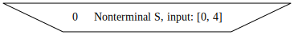

# Reading the SPPF

**SPPF** (Shared Packed Parse Forest) is a derivation-tree-like structure that represents **all** possible paths
satisfying the specified grammar. If the number of such paths is infinite, the SPPF contains cycles.

The SPPF consists of several node types. Each node has a unique ID and stores type-specific information.

* A **non-terminal** node contains the name of a non-terminal and pairs of vertices from the input graph that mark the start and end of paths derived from that non-terminal.

  

  This node has ID ```0``` and is the root of all derivations for paths from vertex 1 to vertex 4 derivable from non-terminal ```S```.

* A **terminal** node is a leaf and corresponds to an edge.

  

  This node depicts edge ```3 -alloc-> 4```.

* An **epsilon** node represents that $\varepsilon$ is derived at a specific position.

  

* A **range** node is a supplementary node that helps reuse subtrees.

  

  This node represents all subpaths from 0 to 4 that are accepted while the RSM transitions from ```S_0``` to ```S_2```.

* An **intermediate** node is a supplementary node used to connect subpaths.

  

  This node indicates that the path from 0 to 2 consists of two parts: from 0 to 1 and from 1 to 2.
