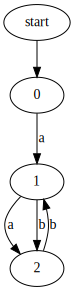
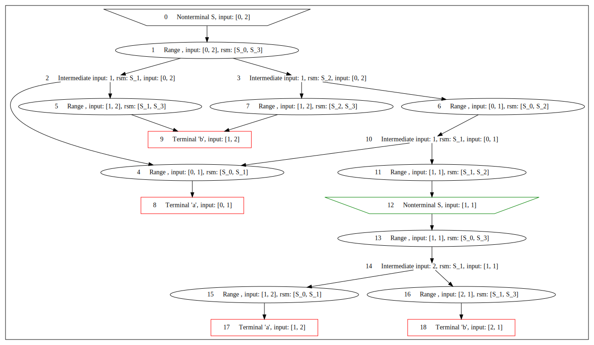
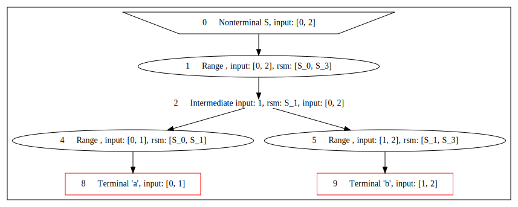
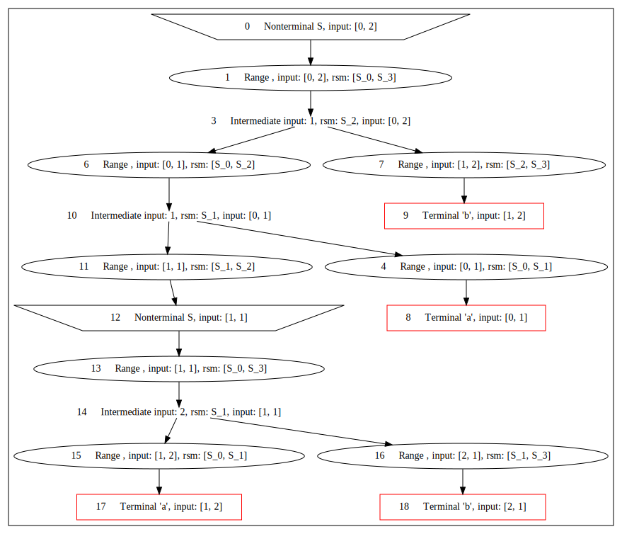
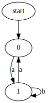
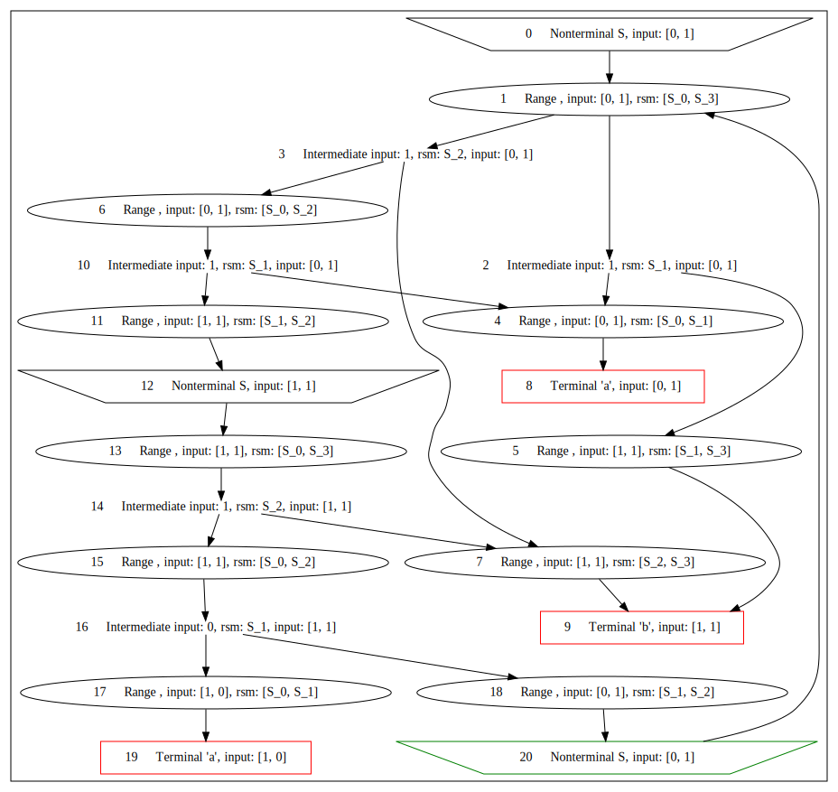
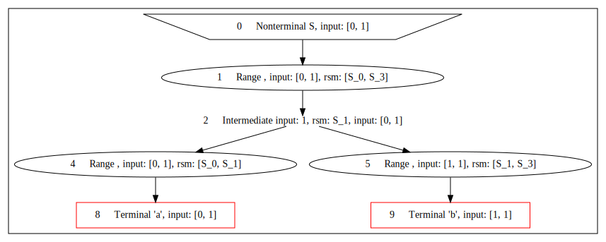
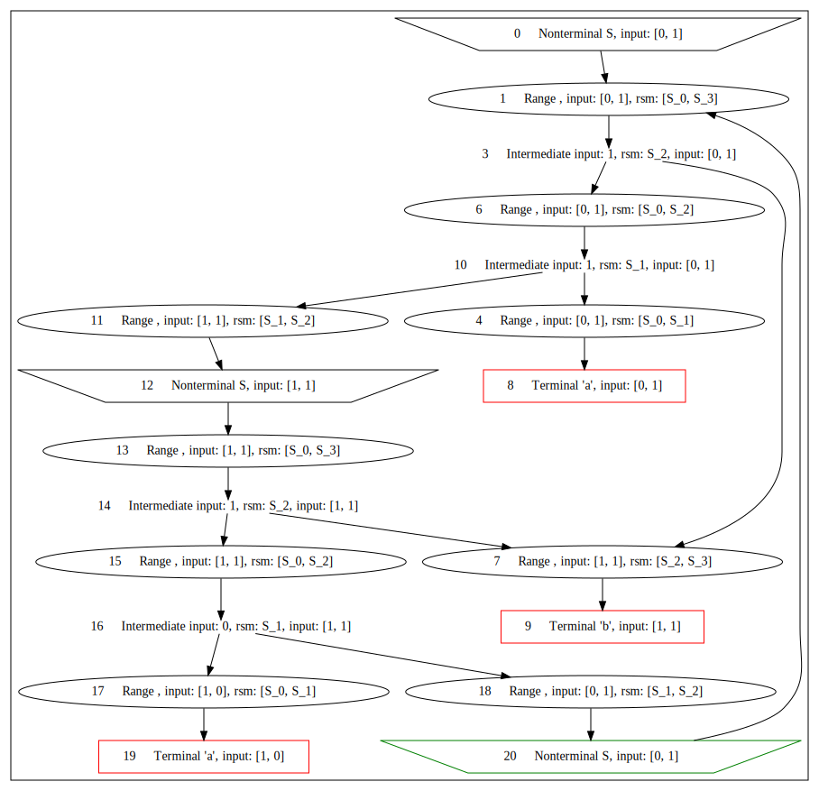

# Using UCFS with simple examples

Set the grammar in
```cfpq-paths-app/src/main/kotlin/org.ucfs.paths/examples/example_1.kt```

**Grammar assignment**

Define the grammar for the language $a^n b^n$: words consisting of $n$ occurrences of $a$ followed by $n$
occurrences of $b$ (e.g., $ab$, $aabb$, $aaabbb$).
> [!NOTE]
> The grammar can be defined equivalently as follows.
>```kotlin
>class AnBnGrammar : Grammar() {
>    val S by Nt().asStart()
>
>    init {
>        S /= "a" * Option(S) * "b"
>    }
>}
>```
>or
>```kotlin
>class AnBnGrammar : Grammar() {
>    val S by Nt().asStart()
>
>    init {
>        S /= "a" * (Epsilon or S) * "b"
>    }
>}
>```

A **recursive state machine** ([RSM](https://www.researchgate.net/publication/226965977_Analysis_of_Recursive_State_Machines)) is an automaton-like representation of a context-free grammar.

The RSM for the $a^n b^n$ grammar:


The start non-terminal $S$ expands to either the terminal string $ab$ or the string $aSb$.

> [!NOTE]
> To confirm this, look at the labels along the edges of the path from the source node (green circle) to the sink node
> (red circle).

**To run (from project root):**

```bash
./gradlew :cfpq-paths-app:runSimpleExamples 
```

**Example 1: Simple graph with a <ins>finite</ins> set of paths**

**Input graph:**



The following words satisfy the grammar:

* $ab$ (0 -a-> 1 -b-> 2)
* $aabb$ (0 -a-> 1 -a-> 2 -b-> 1 -b-> 2)

**Resulting SPPF graph:**



The SPPF decomposes into two trees:

**The *first* tree:**



The first tree corresponds to the word $ab$.

**The *second* tree:**



The second tree corresponds to the word $aabb$.

The result matches the expected language.

**Example 2: Simple graph with an <ins>infinite</ins> number of paths #1**

**Input graph:**



Examples of words that satisfy the grammar:

* $ab$ (0 -a-> 1 -b-> 1)
* $aaabbb$ (0 -a-> 1 -a-> 0 -a-> 1 -b-> 1 -b-> 1 -b-> 1)
* ...

> [!NOTE]
> The language contains infinitely many words of the form $a^nb^n$ where $n$ is odd.

**Resulting SPPF graph:**



> [!NOTE]
> This example shows that although the number of paths is infinite, the SPPF remains finite when a depth limit
> is applied.

The SPPF decomposes into two trees:

**The *first* tree:**



The first tree corresponds to the word $ab$.


**The *second* pre-tree:**



> [!NOTE]
> The SPPF contains a cycle. The label sequence $aaSbb$ includes the non-terminal $S$, which can be expanded further
> to obtain $aaabbb$, $aaaaabbbbb$, and so on.

Let's expand the nonterminal to construct the tree.

**The *second* tree:**


This tree corresponds to the word $aaabbb$.

The result matches the expected language.

**Example 3: Simple graph with an <ins>infinite</ins> set of paths #2**

**Input graph:**


Examples of words that satisfy the grammar:

* $ab$ (1 -a-> 2 -b-> 3)
* $aabb$ (0 -a-> 1 -a-> 2 -b-> 3 -b-> 2)
* $aaabbb$ (2 -a-> 0 -a-> 1 -a-> 2 -b-> 3 -b-> 2 -b-> 3)
* ...

> [!NOTE]
> The graph yields infinitely many words that cover the full language, because it has several start vertices.

The resulting SPPF is too large to include here; see
```src/main/resources/figures/example_3_graph_sppf.dot.svg```

# PointsTo analysis

The following examples illustrate UCFS on analysis-style graphs.

**Grammar and code for paths extraction:** ```cfpq-paths-app/src/main/kotlin/org.ucfs.paths/Main.kt```

**To run (from project root)**:

```bash
./gradlew :cfpq-paths-app:run
```

> [!NOTE]
> Path extraction uses a naive traversal algorithm intended only to demonstrate SPPF traversal.

Below are code snippets, input graphs, fragments of the resulting SPPFs, and extracted paths.

The analysis uses the following extended points-to grammar (start non-terminal ```S```) to model field-access chains.

```
PointsTo -> ("assign" | ("load_i" Alias "store_i"))* "alloc"
FlowsTo -> "alloc_r" ("assign_r" | ("store_i_r" Alias "load_o_r"))*
Alias -> PointsTo FlowsTo
S -> (Alias? "store_i")* PointsTo
```

In all examples below, the grammar uses indices $i \in [0..3]$.
The corresponding RSM:


## Example 1

Code snippet:

```java
val n = new X()
val y = new Y()
val z = new Z()
val l = n
val t = y
l.u = y
t.v = z
```

Corresponding graph:


The resulting SPPF:


Three trees are extracted because there are three paths of interest from node 1.
Subpaths derivable from non-terminals ```Alias``` and ```PointsTo``` are omitted, because they do not contribute
to recovering field assignments.

Extracted paths:

* [(1-PointsTo->0)]

  This path is trivial. Such paths will be omitted in further examples.

* [(1-Alias->2), (2-store_0->3), (3-PointsTo->4)]

  This path corresponds to ```n.u = new Y()```. Vertex 2 is an alias of 1 (```n```); the ```store_0``` edge models ```l.u = y```.

* [(1-Alias->2), (2-store_0->3), (3-Alias->5), (5-store_1->6), (6-PointsTo->7)]

  This path corresponds to ```n.u.v = new Z()```.

## Example 2

Code snippet:

```java
val n = new X()
val l = n
while (...){    
    l.next = new X()
    l = l.next
}
```

Corresponding graph:


Part of the resulting SPPF:


This fragment contains a cycle on vertices 27–31–34–37–38–40–42–44–47–49–52–56 (shown in red), indicating infinitely
many paths of interest. A sample of extracted paths:

* [(0-Alias->2), (2-store_0->3), (3-PointsTo->4)]

  ```n.next = new X () // line 4```

* [(0-Alias->2), (2-store_0->3), (3-Alias->2), (2-store_0->3), (3-PointsTo->4)]

  ```n.next.next = new X () // line 4```

* [(0-Alias->2), (2-store_0->3), (3-Alias->2), (2-store_0->3), (3-Alias->2), (2-store_0->3), (3-PointsTo->4)]

  ```n.next.next.next = new X () // line 4```

* [(0-Alias->2), (2-store_0->3), (3-Alias->2), (2-store_0->3), (3-Alias->2), (2-store_0->3), (3-Alias->2), (2-store_0->3), (3-PointsTo->4)]

  ```n.next.next.next.next = new X () // line 4```

* [(0-Alias->2), (2-store_0->3), (3-Alias->2), (2-store_0->3), (3-Alias->2), (2-store_0->3), (3-Alias->2), (2-store_0->3), (3-Alias->2), (2-store_0->3), (3-PointsTo->4)]

  ```n.next.next.next.next.next = new X () // line 4```

* [(0-Alias->2), (2-store_0->3), (3-Alias->2), (2-store_0->3), (3-Alias->2), (2-store_0->3), (3-Alias->2), (2-store_0->3), (3-Alias->2), (2-store_0->3), (3-Alias->2), (2-store_0->3), (3-PointsTo->4)]

  ```n.next.next.next.next.next.next = new X () // line 4```

More paths can be extracted if needed. Traversal should be tuned accordingly.

## Example 3

Code snippet:

```java
val n = new X()
val l = n
while (...){
    val t = new X()
    l.next = t
    l = t
}
```

Corresponding graph:


Part of the resulting SPPF:


This SPPF also contains a cycle on vertices 3–5–7–11; therefore, infinitely many paths of interest exist. Only a sample
is listed below.

* [(0-Alias->1), (1-store_0->2), (2-PointsTo->3)]

  ```n.next = new X() // line 4```

* [(0-Alias->1), (1-store_0->2), (2-Alias->1), (1-store_0->2), (2-PointsTo->3)]

  ```n.next.next = new X() // line 4```

* [(0-Alias->1), (1-store_0->2), (2-Alias->1), (1-store_0->2), (2-Alias->1), (1-store_0->2), (2-PointsTo->3)]

  ```n.next.next.next = new X() // line 4```

* [(0-Alias->1), (1-store_0->2), (2-Alias->1), (1-store_0->2), (2-Alias->1), (1-store_0->2), (2-Alias->1), (1-store_0->2), (2-PointsTo->3)]

  ```n.next.next.next.next = new X() // line 4```

* [(0-Alias->1), (1-store_0->2), (2-Alias->1), (1-store_0->2), (2-Alias->1), (1-store_0->2), (2-Alias->1), (1-store_0->2), (2-Alias->1), (1-store_0->2), (2-PointsTo->3)]

  ```n.next.next.next.next.next = new X() // line 4```

* [(0-Alias->1), (1-store_0->2), (2-Alias->1), (1-store_0->2), (2-Alias->1), (1-store_0->2), (2-Alias->1), (1-store_0->2), (2-Alias->1), (1-store_0->2), (2-Alias->1), (1-store_0->2), (2-PointsTo->3)]

  ```n.next.next.next.next.next.next = new X() // line 4```

## Example 4

Code snippet:

```java
val n = new X()
val z = new Z()
val u = new U()
z.x = n
u.y = n
val v = z.x
v.p = new Y()
val r = u.y
r.q = new P()
```

Corresponding graph:


For this example, the SPPF figure is omitted due to size; only the extracted paths are listed. The query uses two start
vertices: 1 and 8.

* [(1-Alias->9), (9-store_3->11), (11-PointsTo->13)]

  ```n.q = new P()```

* [(1-Alias->8), (8-store_2->10), (10-PointsTo->12)]

  ```n.p = new Y() ```

* [(8-Alias->9), (9-store_3->11), (11-PointsTo->13)]

  ```v.q = new P() ```

* [(8-store_2->10), (10-PointsTo->12)]

  ```v.p = new Y() ```

* [(8-Alias->8), (8-store_2->10), (10-PointsTo->12)]

  ```v.p = new Y() ```

